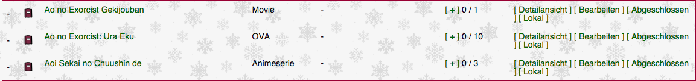

proxer-local-status
===================

A chrome extension for proxer.me to display whether or not you have an anime locally (hard drive / cd / dvd).

Features
========
- Chrome Sync
- Displays in anime list and on every anime page (TODO)
- Easy toggle
- EN / DE

Installation
============
To install this plugin simply clone this repository to anywhere you like
```
git clone https://github.com/kumpelblase2/proxer-local-status
```
In chrome go to `Settings` -> `Extensions`. Here enable `Developer mode` to enable loading of unpackaged extensions. Note this won't be necessary in the future, but since this is still in development it is necessary. Then click on `Load unpackaged extension` and select the folder of the repository.

Usage
=====
When you go to your anime list in your control panel and reload the page (reload might not be necessary but is advised), you should have a new column in the tables and a new action for your animes. 
The leftmost indicator displays whether or not you have the anime on your disk.
- `-` : Not on disk
- `X` : On Disk

On the right there's a new action: `[ Local ]` / `[ Not local ]` These actions allow you to toggle whether or not you have it saved as local or not.
